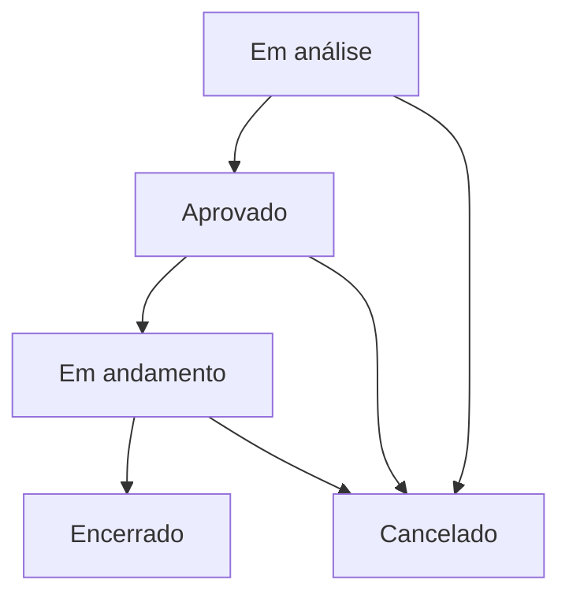

# Especificação Técnica do Projeto (Spec Driven)

Este documento especifica os requisitos de negócio, funcionais e técnicos para a aplicação de Gerenciamento Simplificado de Projetos.

## 1. Modelo de Dados (Projeto)

Cada projeto é composto pelas seguintes informações:

| Campo | Tipo | Descrição | Restrições |
| :--- | :--- | :--- | :--- |
| `id` | UUID / String | Identificador único do projeto | Gerado automaticamente (UUID v4) |
| `name` | String | Nome do projeto | Obrigatório, min 3 caracteres |
| `startDate` | Date | Data de início real do projeto | Obrigatória |
| `endDate` | Date | Previsão de término do projeto | Obrigatória, deve ser >= `startDate` |
| `budget` | Decimal / Number | Orçamento total do projeto | Obrigatório, >= 0 |
| `description` | String | Descrição textual do escopo | Opcional |
| `status` | Enum | Estado atual do projeto | Padrão: `EM_ANALISE` |
| `risk` | Enum | Classificação de risco automático | Calculado automaticamente (`BAIXO`, `MEDIO`, `ALTO`) |

---

## 2. Regras de Negócio Obrigatórias

### 2.1. Transição de Status do Projeto
O status do projeto segue um ciclo de vida controlado. As transições permitidas são estritas:



- **Ponto de Partida:** Todo projeto novo é criado obrigatoriamente com o status `Em análise`.
- **Transições Permitidas:**
  - `Em análise` ➔ `Aprovado`
  - `Aprovado` ➔ `Em andamento`
  - `Em andamento` ➔ `Encerrado`
  - `Qualquer status` ➔ `Cancelado`
- **Restrição:** Não é permitido pular etapas (ex: de `Em análise` direto para `Em andamento`).
- **Bloqueio de Exclusão:** Projetos com status `Em andamento` ou `Encerrado` **não podem ser excluídos** do sistema.

### 2.2. Cálculo Automático de Risco
O risco do projeto é recalculado automaticamente no backend durante a criação ou qualquer atualização das seguintes variáveis: `budget`, `startDate` e `endDate`.
O cálculo baseia-se no orçamento e no prazo total do projeto (diferença em dias/meses entre `startDate` e `endDate`).

- **Baixo Risco:**
  - Orçamento de até R$ 100.000 **E** prazo de até 3 meses (definido tecnicamente como <= 90 dias).
- **Médio Risco:**
  - Orçamento entre R$ 100.001 e R$ 500.000 **OU** prazo maior que 3 meses (90 dias) e menor ou igual a 6 meses (180 dias).
- **Alto Risco:**
  - Orçamento acima de R$ 500.000 **OU** prazo superior a 6 meses (180 dias).

> [!IMPORTANT]
> **Regra de Prevalência:** Quando mais de uma regra se aplicar (ex: orçamento de baixo risco mas prazo de alto risco), **deve prevalecer o maior risco** (neste caso, `ALTO`).

---

## 3. Arquitetura e Contrato do Backend (NestJS)

O backend seguirá a separação clássica de responsabilidades:
`Controller ➔ DTOs ➔ Service ➔ Repository / Prisma Client (PostgreSQL)`

### 3.1. Infraestrutura & Persistência
- Banco de dados: **PostgreSQL** executado em container **Docker**.
- ORM: **Prisma** com schema relacional conectando ao PostgreSQL.
- Inicialização local simplificada via `docker-compose.yml` para o banco de dados.

### 3.2. Endpoints da API REST

#### `POST /projects`
- **Objetivo:** Criar um projeto.
- **Entrada (DTO):**
  ```json
  {
    "name": "Nova API de Vendas",
    "startDate": "2026-07-01T00:00:00Z",
    "endDate": "2026-10-01T00:00:00Z",
    "budget": 120000,
    "description": "Desenvolvimento do backend de vendas."
  }
  ```
- **Processamento:**
  - Valida dados de entrada (startDate, endDate, budget, etc.).
  - Define `status = 'EM_ANALISE'`.
  - Calcula o `risk` com base no `budget` e prazo.
- **Retorno:** JSON do projeto criado com `id`, `status` e `risk` preenchidos.

#### `GET /projects`
- **Objetivo:** Listar todos os projetos cadastrados.
- **Retorno:** Array de projetos.

#### `GET /projects/:id`
- **Objetivo:** Buscar os detalhes de um projeto por ID.
- **Retorno:** Detalhes completos do projeto ou erro `404` se não encontrado.

#### `PATCH /projects/:id`
- **Objetivo:** Atualizar os dados de um projeto (exceto status).
- **Entrada (DTO):** Permite alterar `name`, `startDate`, `endDate`, `budget` e `description`.
- **Processamento:** Se `startDate`, `endDate` ou `budget` forem alterados, recalcula o `risk`.
- **Retorno:** Projeto atualizado.

#### `PATCH /projects/:id/status`
- **Objetivo:** Alterar o status do projeto.
- **Entrada (DTO):** ` { "status": "APROVADO" } `
- **Processamento:** Valida a transição de status segundo as regras de negócio. Retorna erro `400` se a transição for inválida.
- **Retorno:** Projeto com status atualizado.

#### `DELETE /projects/:id`
- **Objetivo:** Excluir um projeto.
- **Processamento:** Verifica se o status do projeto é `EM_ANDAMENTO` ou `ENCERRADO`. Se sim, bloqueia a exclusão retornando erro `400`.
- **Retorno:** Confirmação de exclusão (status `204` ou mensagem de sucesso).

#### `GET /projects/:id/ai-analysis`
- **Objetivo:** Gerar análise inteligente do projeto com apoio de IA.
- **Processamento:** O service busca os dados do projeto, aciona o `ProjectAnalysisPromptBuilder` para compor o prompt e envia ao `AiClient` que encapsula o `AiAnalysisService` (integrando com a API real do Gemini).
- **Retorno:**
  ```json
  {
    "summary": "Resumo analítico do escopo, prazo e saúde financeira do projeto.",
    "pointsOfAttention": ["Risco calculado alto devido ao prazo longo.", "Orçamento apertado para a complexidade."],
    "executiveRecommendation": "Recomendamos que a equipe técnica seja alocada imediatamente e as transições de status sigam a sequência correta."
  }
  ```

---

## 4. Arquitetura do Frontend (React)

A interface será construída como uma SPA em React (TypeScript) usando Vite, estilizada com Tailwind CSS e componentes acessíveis do Shadcn UI.

### 4.1. Tecnologias Visuais
- **Tailwind CSS:** Para estilização customizada e utilitária.
- **Shadcn UI (Radix Primitives + Lucide Icons):** Para tabelas, modais, formulários, botões e toasts. Garante conformidade de acessibilidade (a11y) e design visual premium.

### 4.2. Páginas/Views
- **Dashboard / Listagem de Projetos:**
  - Tabela responsiva com as colunas: Nome, Status (badge colorido), Risco (badge colorido: Baixo - verde, Médio - amarelo, Alto - vermelho), Orçamento (formatado BRL), Início, Término, e Ações.
  - Botão de "Criar Novo Projeto".
  - Ações por linha: Detalhes, Editar, Excluir (desabilitado se em andamento/encerrado), e Análise IA.
- **Formulário de Cadastro/Edição:**
  - Campos: Nome, Orçamento, Data Início, Previsão Término, Descrição.
  - Validações em tempo de digitação (ex: data de término posterior ao início) utilizando React Hook Form + Zod.
- **Painel/Modal de Detalhes:**
  - Exibição limpa de todas as informações.
  - Botões de Ação de Fluxo de Trabalho:
    - Avançar Status (ex: de "Em análise" para "Aprovado").
    - Cancelar Projeto (botão de atalho rápido para ir direto a "Cancelado" a partir de qualquer status).
  - Seção de Análise IA: Botão "Solicitar Análise com IA" que dispara o carregamento, exibindo um esqueleto/loading animado, e exibe o resultado formatado (Resumo, Pontos de Atenção, Recomendação) com transição suave.
